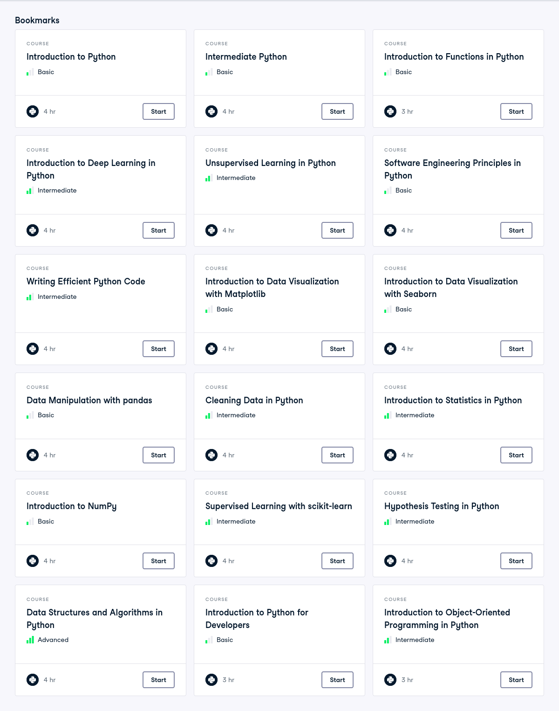

# Resources for course preparation

## **Bash** (Bourne Again SHell) 

is a powerful command-line tool that makes it easy to manage software and work on remote machines via [the terminal](https://github.com/sasselab-teaching/Preparation_GS2F_seminar/blob/main/course_resources/Setup_work_environment.md). With Bash, you can quickly install and update Python packages using tools like `pip` or `conda`, making project setup and dependency management much more efficient. It’s especially important for working on remote servers, where you don’t have a graphical interface and need to rely on terminal commands to navigate files, set up environments, and run programs. Knowing Bash simplifies installing packages, managing projects, and maintaining productivity when working in remote or cloud-based environments.

See [here for basics](https://github.com/sasselab-teaching/Preparation_GS2F_seminar/blob/main/course_resources/Setup_work_environment.md)

## Managing python packages

When you work locally on your own computer, we recommend that use a package managing system. 

conda is a **system** package manager. pip is a **Python** package manager. 

With conda you can install much more than just Python libraries.  You can install entire software stacks such as Python + Django + Celery + PostgreSQL + nginx. You can install R, R libraries, Node.js, Java  programs, C and C++ programs and libraries, Perl programs, the list is  pretty long and limitless. conda has an `env` system that  allows you to have all of these installed across multiple different  environments. Also, conda is able to do all these software and package  installations in an isolated, userspace manner. This is *critical* because it means that you can install complex software stacks on a  system (such as your employer's heavily regulated production server) **without** needing root privileges.

On the other hand, pip can only install Python packages, and it quite often screws up the installations on multi-user systems, breaking global system dependencies and/or the user's dependency stacks. This is why  people who rely only on pip MUST use virtualenv. 

Please see here how to set up your [virtual environment](https://github.com/sasselab-teaching/Preparation_GS2F_seminar/blob/main/course_resources/Setup_work_environment.md)

For example use:

- [Miniconda](https://www.anaconda.com/docs/getting-started/miniconda/install): is s minimal installer for Conda that provides Conda itself (~400MB), but without all the extra pre-installed packages that come with Anaconda (~4GB).
- [Mamba](https://mamba.readthedocs.io/en/latest/installation/mamba-installation.html) is a modern alternative to Miniconda.
- [Venv and pip](https://packaging.python.org/en/latest/guides/installing-using-pip-and-virtual-environments/)

## VS Code

For writing code outside Jupyter Lab, we recommend using **Visual Studio Code (VS Code)** . VS Code is a free, open-source code editor developed by Microsoft. It is lightweight, fast, and highly customizable, making it one of the most popular tools for programmers.

- [Getting started](https://code.visualstudio.com/docs/introvideos/basics)
- Has many useful [extensions](https://marketplace.visualstudio.com/VSCode) that make writing code much easier. Install them easily after opening the app. For example, there is Jupyter extension to directly use Jupyter Lab, and an extension to connect with a remote machine (Remote-SSH), as well as git, and many more useful ones. 
- Get suggestions and help during code development with [GitHub's Copilot](https://code.visualstudio.com/docs/copilot/overview) directly in Vs Code
  - You should apply for [GitHub education](https://docs.github.com/en/education/about-github-education/github-education-for-students/apply-to-github-education-as-a-student) with your student card to get unlimited access to Copilot Pro

## Version control with Git(Hub)

Version control is a system that helps developers track and manage changes to their code over time. **Git** is a powerful distributed version control tool that allows multiple people to work on a project simultaneously, keeping a history of all modifications and enabling easy collaboration, branching, and merging. **GitHub** is a cloud-based platform built on top of Git that provides hosting for repositories, making it simple to share code, review changes, and contribute to open-source or team projects. Together, Git and GitHub ensure smoother collaboration, better organization, and safer development practices.

- [Short summary](https://github.com/sasselab-teaching/GenomicS2F_seminar/blob/main/course_resources/github_basics.md)

## Useful Python Libraries

Please take a close look at some of the tutorials for these common python libraries. Run them on your own computer or use google colab. You should be able to work with their objects and create nice looking figures for your analyses. 

- [numpy](https://numpy.org/doc/stable/user/quickstart.html)
- [pandas](https://pandas.pydata.org/docs/user_guide/10min.html)
- [sci-kit learn](https://scikit-learn.org/stable/)
- [scipy](https://docs.scipy.org/doc/scipy/tutorial/)
  - [scipy.stats](https://docs.scipy.org/doc/scipy/tutorial/stats.html)
- [matplotlib](https://matplotlib.org/stable/tutorials/index.html)
- [seaborn](https://seaborn.pydata.org/tutorial.html)
- [Logomaker](https://logomaker.readthedocs.io/en/latest/examples.html)
- [statsmodels](https://www.statsmodels.org/stable/examples/index.html)
- [pytorch](https://docs.pytorch.org/tutorials/)
- [pytorch.lightning](https://lightning.ai/docs/pytorch/stable/tutorials.html)
- [h5py](https://docs.h5py.org/en/latest/quick.html)

## Jupyter Lab

JupyterLab is a web-based interactive development environment for working with notebooks, code, and data. It is a next-generation user interface for Project Jupyter, offering a  flexible and customizable workspace for data science, scientific  computing, and machine learning. It allows users to arrange multiple documents and activities side by side using tabs and splitters.

- [Install](https://jupyterlab.readthedocs.io/en/stable/getting_started/overview.html) and try it out with some tutorials

## [BwVisu](https://www.urz.uni-heidelberg.de/en/service-catalogue/software-and-applications/bwvisu)

For our tutorials, we will work with interactive nodes on Helix, similar to google colab. The web-based service [bwVisu](https://www.urz.uni-heidelberg.de/en/service-catalogue/software-and-applications/bwvisu) enables the user-friendly execution of  interactive and graphical applications on the powerful hardware of the  supercomputer bwForCluster Helix for the processing of scientific data  stored in bwForCluster Helix and in the storage service SDS@hd. A list  of available applications can be found in the bwVisu Wiki. bwVisu can  also be used for courses and workshops.

BwVisu requires a Uni-ID and at least membership of a ["**Speichervorhaben**“ (SV) (data storage projects)](https://www.urz.uni-heidelberg.de/de/service-katalog/speicher/sdshd-scientific-data-storage), or a ["**Rechenvorhaben**" (RV) (compute project)](https://wiki.bwhpc.de/e/Registration/bwForCluster). How to sign up for both related to this course will be provided to you at earliest possible time. 

Check out their [Wiki](https://wiki.bwhpc.de/e/Helix/bwVisu) for all the information you need to get it to run.

After opening a Jupyter Notebook on BwVisu, you should be able to create notebooks and use the terminal to also [create your environments, install packages, and create iPython Kernels](https://wiki.bwhpc.de/e/Helix/bwVisu/JupyterLab) to run your notebooks. 

## [Helix](https://www.urz.uni-heidelberg.de/de/service-katalog/hochleistungsrechnen/bwforcluster-helix)

To train models with python scripts (see for example, [model_training.py]((https://github.com/sasselab-teaching/Preparation_GS2F_seminar/blob/main/course_resources/models.py.md))) over night for final production, we will use the [BwForCluster Helix](https://www.urz.uni-heidelberg.de/de/service-katalog/hochleistungsrechnen/bwforcluster-helix). To be able to use the cluster you need to join our 

- [**Rechenvorhaben (RV)**](https://wiki.bwhpc.de/e/Registration/bwForCluster)

For instructions how to join the RV and SV for this course please contact [office-sasse@zmbh.uni-heidelberg.de](office-sasse@zmbh.uni-heidelberg.de)

### Slurm

The Helix cluster, similar to other High Performance Computing (HPC) Systems at universities and institutions around the world, uses a queuing system that organizes access to CPU and GPU resources. This system gives certain time, memory, and compute to users to fairly share the resources. To use it, you will have to use a few commands after connecting to the cluster

- [Slurm commands](https://wiki.bwhpc.de/e/Helix/Slurm)
- [Slurm example script](https://github.com/sasselab-teaching/GenomicS2F_seminar//blob/main/course_resources/slurm_example.sh) 

### Watch your usage

On the Helix cluster, time and resources are shared between all users. The available share of others in your RV depends on the total amount of requested memory and compute by all users. So please try to optimize your usage, and only request as much as you need! Please make sure to monitor your usage with [Grafana](https://helix-monitoring.bwservices.uni-heidelberg.de) and adjust your requested resources after each run. Good practice can be perform some test runs before training your model for several hours. 

### Run python script

You can run a Python script directly from the terminal by calling the Python interpreter and passing the script name, along with any arguments you want to provide. For example:

```bash
python program.py --argument value
```

In this example, `program.py` is your script, and `--argument value` is an input you pass to it. To handle such arguments inside your script, you can use the built-in **argparse** library. It lets you define what arguments your program accepts and automatically generates helpful messages. For instance:

```python
import argparse

parser = argparse.ArgumentParser(description="Example script")
parser.add_argument("--argument", type=str, help="An example argument")
args = parser.parse_args()

print(f"You passed: {args.argument}")
```

Now, when you run `python program.py --argument hello`, it will print:

```
You passed: hello
```

This makes your Python scripts flexible, reusable, and easy to run with different inputs.

## Python Packaging for module sharing

Python installable packages make it easy to share and reuse code across your assignments and projects. Using **pip**, you can install packages from the Python Package Index (PyPI) or other sources with a single command. To create your own package, tools like **setuptools** let you define your project’s metadata—such as its name, version, and dependencies—in a `setup.py` or `pyproject.toml` file. This way, you or your teammates can quickly install your shared functions, objects, and modules into your environment with a single command (`pip install package-name`) , making collaboration and project management much smoother.

- [Short summary](https://github.com/sasselab-teaching/Preparation_GS2F_seminar/blob/main/course_resources/pip_installable_code_base.md)

### Reuse your modules and functions with [setuptools](https://github.com/sasselab-teaching/Preparation_GS2F_seminar/blob/main/resources/pip_installable_code_base.md)

You want to make a Python package that you can install in **editable mode** with 

`pip install -e .` 

This is super useful when you are working on a project and want to use other people's plotting, read, or processing functions, and objects. You can all add the functions to a common `modules.py` script, or even have several python files for different types of objects, e.g. `plot_functions.py`, `io_utils.py`. Before starting to work, you can pull changes that your peers added from github, and start using them simply by `from mypackage.io_utils import readcsv`. Read more [here](https://github.com/sasselab-teaching/Preparation_GS2F_seminar/blob/main/resources/pip_installable_code_base.md). When a package was installed in editable mode, changes in your package will directly be usable without having to install them again.

Try it out with this repository! Install with pip, and import the example module. You can simply edit the `setup.cfg` and `pyproject.toml` and `src/` content to create your own.

```
# If 'hello' function was imported into __init__.py
import prep_package as pp
pp.hello('world')
'Hello, world!'
# Else, you can always import it from the scripts
import prep_package.example_functions as ef
ef.hello('world')
'Hello, world!'
```

## Papers

There are a few [key papers](https://github.com/sasselab-teaching/Preparation_GS2F_seminar/blob/main/course_resources/Reading_list.md) that are defining the field.

## Videos

50-minute talks of students and postdocs about their work on S2F models. Kipoi (pronounce: kípi; from the Greek κήποι: gardens) is an [API](https://github.com/kipoi/kipoi) and a [repository](https://github.com/kipoi/models) of ready-to-use trained models for genomics. It currently contains 2206 different models, covering canonical predictive tasks in transcriptional and post-transcriptional gene regulation. Kipoi's API is implemented as a python package ([github.com/kipoi/kipoi](https://github.com/kipoi/kipoi)) and it is also accessible from the command line or R.          

- [Kipoi](https://www.youtube.com/@kipoiseminar1846)
  - [Alexander Sasse](https://youtu.be/sclPtaX5XyY?si=QYL2ep8XvhYptHq-)
  - [Laura Martens](https://www.youtube.com/watch?v=Rv60lKoGcRE)
  - [Katie Pollard](https://www.youtube.com/watch?v=2C65qfW1RNA)
  - [Jian Zhou](https://youtu.be/UecUOObUe6k?si=GGEt2MH9Ki1U_19A)
  - [Peter Koo](https://youtu.be/EXtf0k1dVLk?si=ox0iRkFDS-cv8rv4)
  - [Bernard P. de Almeida](https://youtu.be/09zZhhOUHTo?si=qQUaqXaE9iLf5v6g)
  - [Avanti Shrikumar](https://youtu.be/23V7OeaPzHI?si=kiKtvrukI3jJtOW4)

- [Exploring in-silico representations of the regulatory code - Julien Gagneur - RegSys](https://www.youtube.com/watch?v=xFq2zlth7CM)
- [ACC2024: Deciphering regulatory syntax and genetic variation with deep learning - Anshul Kundaje](https://youtu.be/IgarvOP4pzs?si=TbkvXcAOTtbz0LyU)
- [Surag Nair (Genentech): Nona model](https://youtu.be/l14Fq1UGQ34?si=GespqykF-tJcAs-0)
- [Surag Nair (Stanford): DagoNN](https://www.youtube.com/live/GmOaz5rPYsU?si=cS-JUvNGotyB7I2i), [tutorial](https://www.youtube.com/live/vTENdMwmclA?si=MEY3Egrd0kNWU4z-)
- [MIA: Carl de Boer, Learning the rules of gene regulation with millions of synthetic promoters](https://youtu.be/rRjgNEHp9mw?si=44fY9ncqKAZBHSpc)

## Python notebook training scripts

- [Here](https://github.com/sasselab-teaching/Preparation_GS2F_seminar/tree/main/notebooks)

## Online courses

1. [DataCamp](https://datacamp.com/courses)

   1. Check out their [python courses](https://app.datacamp.com/learn/courses?technologies=2)
   2. Check out the offered tutorials as well
   3. Here are some selected bookmarks that may be useful to work through



## More Resources and Notebooks

- [Coming soon](link)

## License [](https://creativecommons.org/licenses/by-nc-sa/4.0/)

All course materials (text, slides, images, exercises) are licensed under [CC BY-NC-SA 4.0](https://creativecommons.org/licenses/by-nc-sa/4.0/).
You are free to share and adapt the content for non-commercial purposes, as long as proper attribution is given and adaptations are shared under the same license.

Please see [CONTRIBUTORS.md](CONTRIBUTORS.md) for the full list of contributors.

## Attribution

This course was created by [Alexander Sasse](https://github.com/LXsasse) and contributors.
See [CONTRIBUTORS.md](CONTRIBUTORS.md) for the full list of contributors.

  
